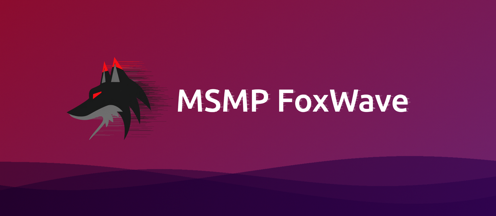

Discord сервер: https://discord.gg/u3dRdUZr6f

PySide6-аудиоплеер, который получает аудиопотоки через `yt-dlp`.

## Установка

```bash
python -m venv .venv
source .venv/bin/activate
pip install -r requirements.txt
```

## Запуск

```bash
python main.py
```

В поле URL можно вставлять ссылки, поддерживаемые `yt-dlp` (YouTube, SoundCloud и т.д.).
Плеер поддерживает плейлист, перемотку и быстрый перезапуск потока после сбоя.

Если YouTube просит авторизацию или показывает антибот-проверку, выберите браузер
с активной сессией в выпадающем списке cookies рядом с полем URL. Плеер передаст
cookies напрямую в библиотеку `yt-dlp`.

Плейлисты импортируются и экспортируются в формате MSMPFoxPlay `.plmsmpsbox`. Это обычный JSON:

```json
{
  "title": "Test",
  "ImgUrl": "https://example.com/cover.png",
  "playlist": [
    {
      "ID": "youtube",
      "name": "Track name",
      "uploader": "Artist",
      "artwork_url": "https://example.com/artwork.jpg",
      "duration": 144,
      "url": "https://www.youtube.com/watch?v=...",
      "Publis": false
    }
  ]
}
```


## Supported Sources:

| Source | Features | Playback |
| :---:| :---: | :---: |
| YouTube | ✅📁💿🎵📻🎚️ | Direct |
| Soundcloud | 🎵🎚️ | Direct |
| Spotify | 💤❌ | Mirror |
| Deezer | ❓ | Direct |
| YandexMusic | ❓🔒 | Direct |
| VkMusic | ❓ | Direct |
| Apple Music | ❌ | Mirror |
| Classic MSMP ID-s | ❌ | ❌ |

### Features

- ✅ Verified and officially supported
- 📁 playlists
- 💿 albums
- 🎵 tracks
- 📻 recommendations
- 🎚️ fast-forwarding and rewinding tracks
- ❓ Not tested
- 🔒 Audio source requires premium account
- 💤 Planned for the future
- ❌ Removed/Not supported/Outdated
